# Deployment einer ToDo-List-Web-Applikation: Dokumentation
> **Fach:** Lernfeld 9 (LF9) | **Klasse:** IFA43 | **Schüler:** Alex Kowert
---
# 1. IP-Adresskonfiguration
1.1 Aktuelle IP-Adresse ermitteln

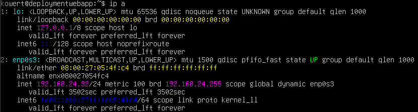

1.2 IP-Konfigurationsdatei aufrufen

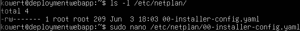

1.3 Änderungen konfigurieren

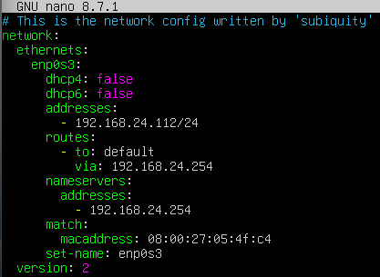
 Speichern mit Strg+O

1.4 Änderungen prüfen und umsetzen

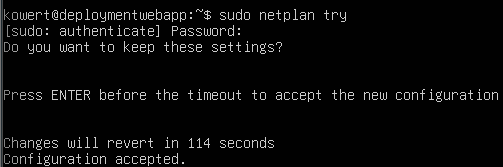

1.5 Kontrolle, ob Einstellungen übernommen wurden

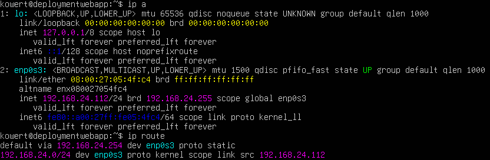

1.6 Anpassungen der Einstellung für privates Netzwerk (zu Hause)

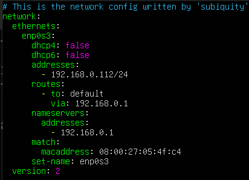

1.7 Separate Konfiguration eingepflegt (zum schnellen Wechseln)

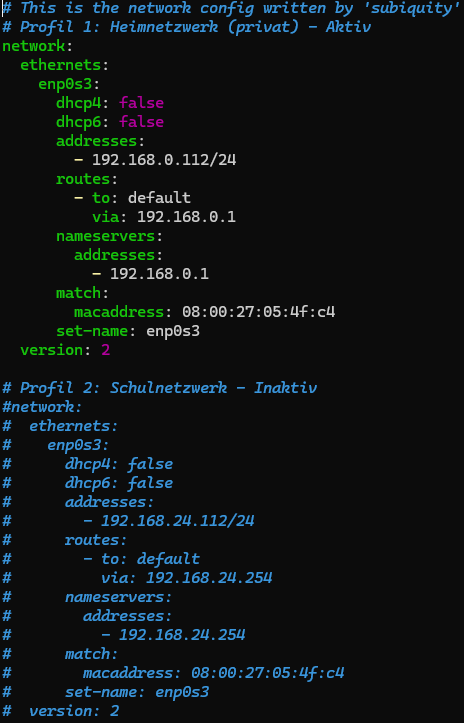

---
# 2. Nutzer anlegen

2.1 Nutzer "willi" anlegen

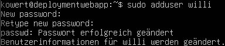

2.2 Nutzer "fernzugriff" anlegen

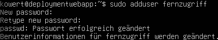

2.3 Nutzer "fernzugriff" Sudo-Rechte geben

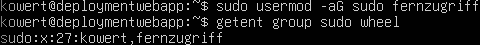

2.4 SSH-Key in Windows anzeigen lassen

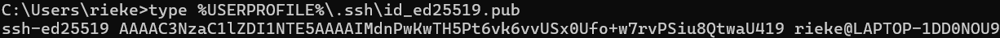

2.5 SSH-Key in Linux Ubuntu hinterlegen

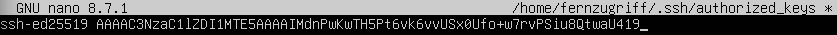

2.6 Besitzrechte und restriktive Zugriffsrechte für das SSH-Verzeichnis konfigurieren

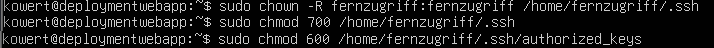
---
# 3. SSH-Verbindung verwenden

3.1 SSH-Schlüssel-Authentifizierung für "fernzugriff" testen

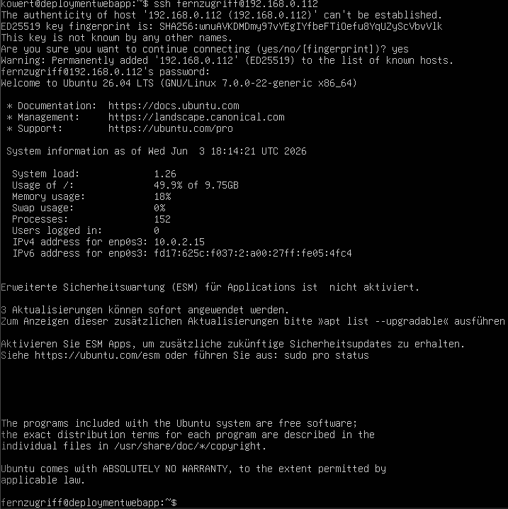

3.2 Zugriff vom Windows-PC auf Linux Ubuntu

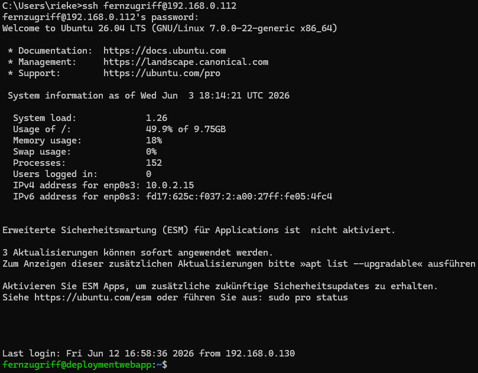
---
# 4. Docker konfigurieren

4.1 Docker installieren

Konsolen-Befehl: sudo apt update && sudo apt install -y docker.io

4.2 Docker-Installation überprüfen

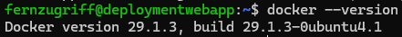

4.3 User "fernzugriff" zu Docker-Gruppe hinzufügen

Konsolen-Befehl: sudo usermod -aG docker fernzugriff

4.4 Gruppenrechte für aktuelle Sitzung übernehmen

Konsolen-Befehl: newgrp docker
---
# 5. To-Do-Liste im Docker-Container einrichten

5.1 SSH-Verbindung schließen und in den Projektordner wechseln

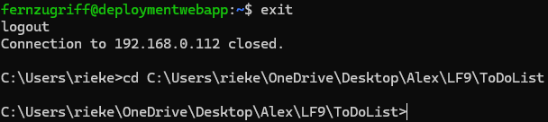

5.2 Docker-Kontext in Windows erstellen

Konsolen-Befehl: docker context create ubuntu-live --docker "host=ssh://fernzugriff@192.168.0.112"

5.3 Docker-Kontext in Windows aktivieren

Konsolen-Befehl: docker context use ubuntu-live

5.4 Überprüfung des korrekten Build-Verzeichnisses

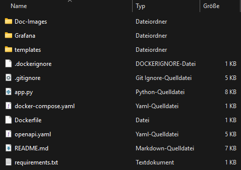
 Die ".dockerignore" definiert nicht benötigte Dateien für den Build

---
# 6. Deployment der ToDo-List-App

6.1 Deplyoment ausführen

Konsolen-Befehl: docker-compose up -d --build

6.2 Docker-Container anzeigen zur Überprüfung

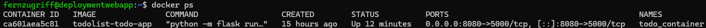

6.3 ToDo-Liste im Browser mittels SwaggerUI ansteuern

    Browser-Eingabe: http://192.168.0.112:8080/swagger/
---
# 7. Firewall einrichten

7.1 Whitelist-Prinzip aktivieren

Konsolen-Befehl 1: sudo ufw default deny incoming

Konsolen-Befehl 2: sudo ufw default allow outgoing

7.2 Ausnahmen definieren (SSH-Port und Web-App-Port)

Konsolen-Befehl 1: sudo ufw allow 22/tcp

Konsolen-Befehl 2: sudo ufw allow 8080/tcp

7.3 Firewall aktiviren

Konsolen-Befehl: sudo ufw enable

7.4 Überprüfung auf korrekte Konfiguration

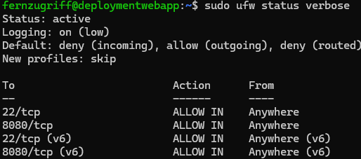
---
# 8. Caddy Reverse-Proxy einrichten, um den Docker-Container vom Internet zu isolieren

8.1 docker-compose.yml anpassen:

Auszug:

    ports:
      - "127.0.0.1:8080:5000"

8.2 Firewall-Regeln anpassen

Konsolen-Befehl 1: sudo ufw delete allow 8080/tcp

Konsolen-Befehl 2: sudo ufw allow 80/tcp

Konsolen-Befehl 3: sudo ufw reload

8.3 Überprüfung auf korrekte Konfiguration

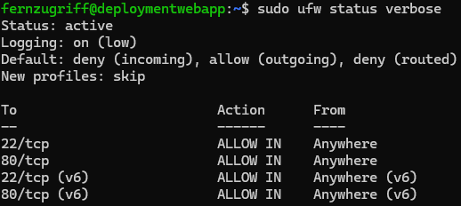

8.4 Installation des Caddy Reverse-Proxys

Konsolen-Befehl 1: sudo apt install -y debian-keyring debian-archive-keyring apt-transport-https curl

Konsolen-Befehl 2: curl -1sLf 'https://dl.cloudsmith.io/public/caddy/stable/gpg.key' | sudo gpg --dearmor -o /usr/share/keyrings/caddy-stable-archive-keyring.gpg

Konsolen-Befehl 3: echo "deb [signed-by=/usr/share/keyrings/caddy-stable-archive-keyring.gpg] https://cloudsmith.io any main" | sudo tee /etc/apt/sources.list.d/caddy-stable.list

Konsolen-Befehl 4: sudo apt update

Konsolen-Befehl 5: sudo apt install -y caddy

8.5 Caddy starten und Status überprüfen

Konsolen-Befehl 1: sudo systemctl start caddy

Konsolen-Befehl 2: sudo systemctl status caddy

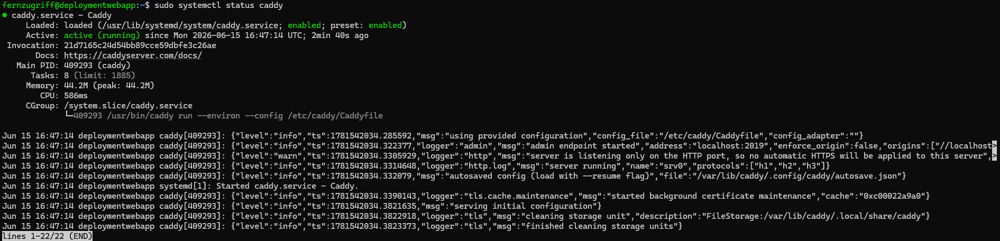

8.6 Konfiguration des Reverse-Proxys (Caddyfile)

Konsolen-Befehl 1: sudo nano /etc/caddy/Caddyfile

Eingefügter Text: 

    :80 {
        reverse_proxy 127.0.0.1:8080
    }

Konsolen-Befehl 2: sudo systemctl reload caddy

8.7 Funktionstest des Caddy Reverse-Proxys

    Browser-Eingabe: http://192.168.0.112/swagger/

8.8 Überprüfung der internen Port-Bindung auf Server-Ebene

Konsolen-Befehl: sudo ss -tulpn | grep :8080

Ausgabe: 

    tcp   LISTEN 0      4096                           127.0.0.1:8080       0.0.0.0:*    users:(("docker-proxy",pid=231573,fd=7))

8.9 Lokale Gegenprobe der Schnittstellen-Isolierung

Konsolen-Befehl: curl -I --connect-timeout 3 http://192.168.0.112:8080

Ausgabe: 

    curl: (7) Failed to connect to 192.168.0.112 port 8080 after 0 ms: Could not connect to server
---
# 9. Server-Monitoring mit Grafana

9.1 Erstellen eines Accounts auf grafana.com

9.2 Grafana-Instanz erstellen

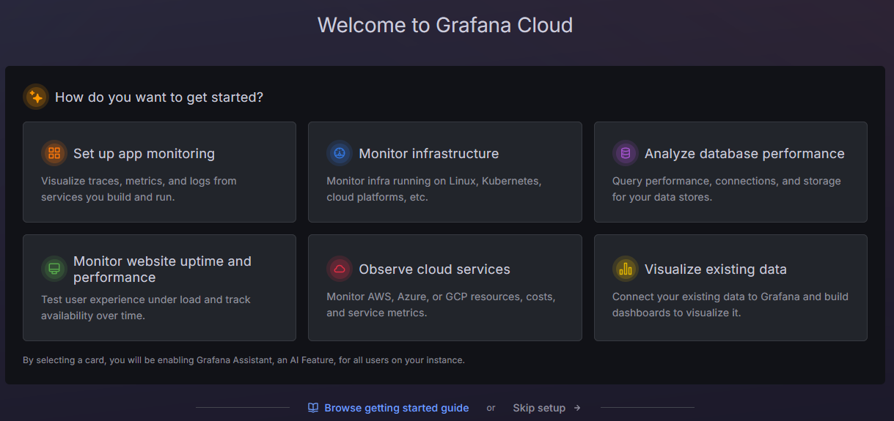
 "Monitor infrastructure" auswählen

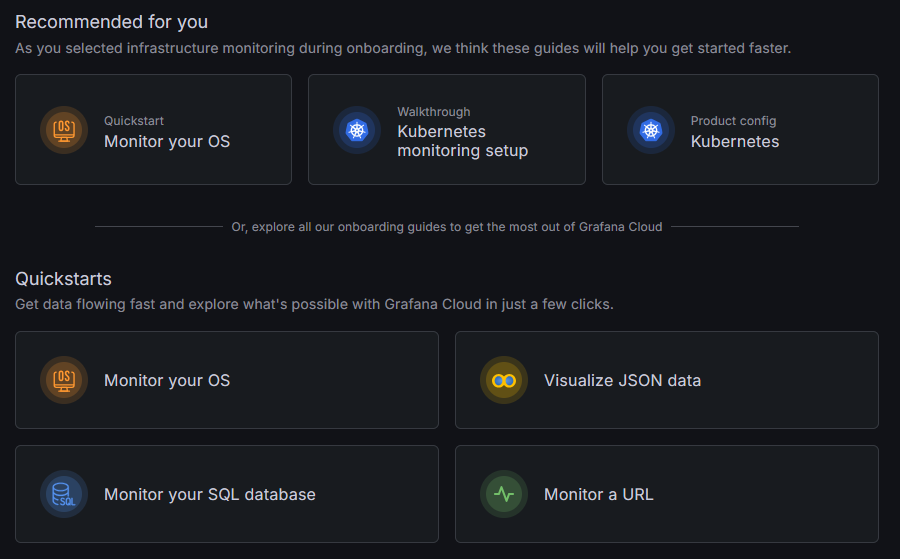
 "Monitor your OS" auswählen

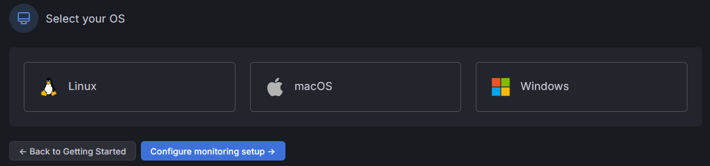
 "Linux" auswählen

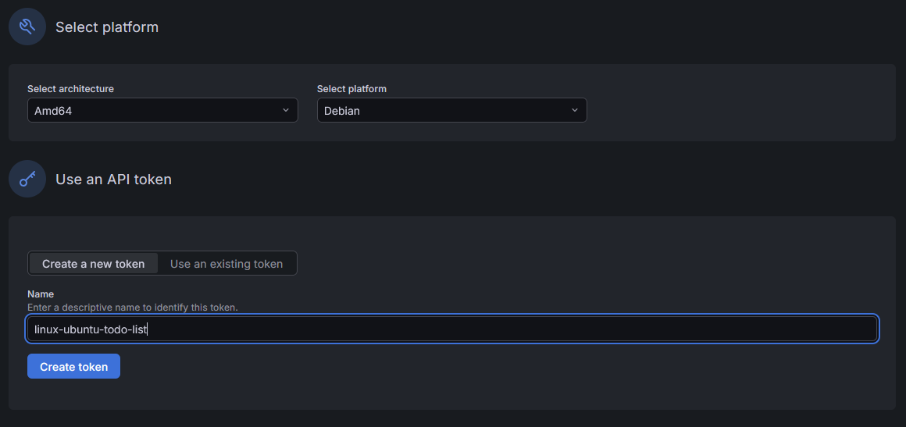
 Token-Erstellung vorbereiten und auf "Create token" klicken

9.3 Grafana Alloy installieren

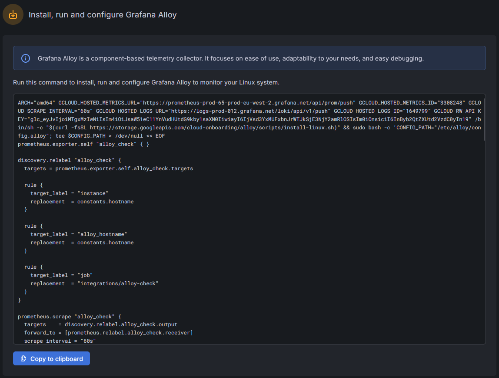
 Installationsskript auf Linux Ubuntu ausführen

9.4 Verbindung testen

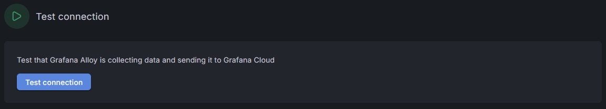
 Auf "Test connection" klicken

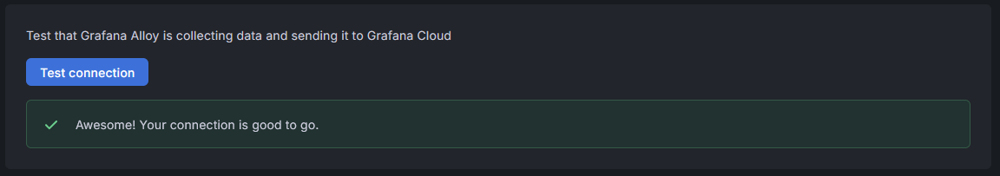

9.5 Dashboard konfigurieren

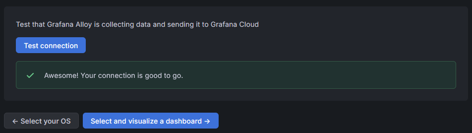
 Auf "Select and visualize a dashboard" klicken

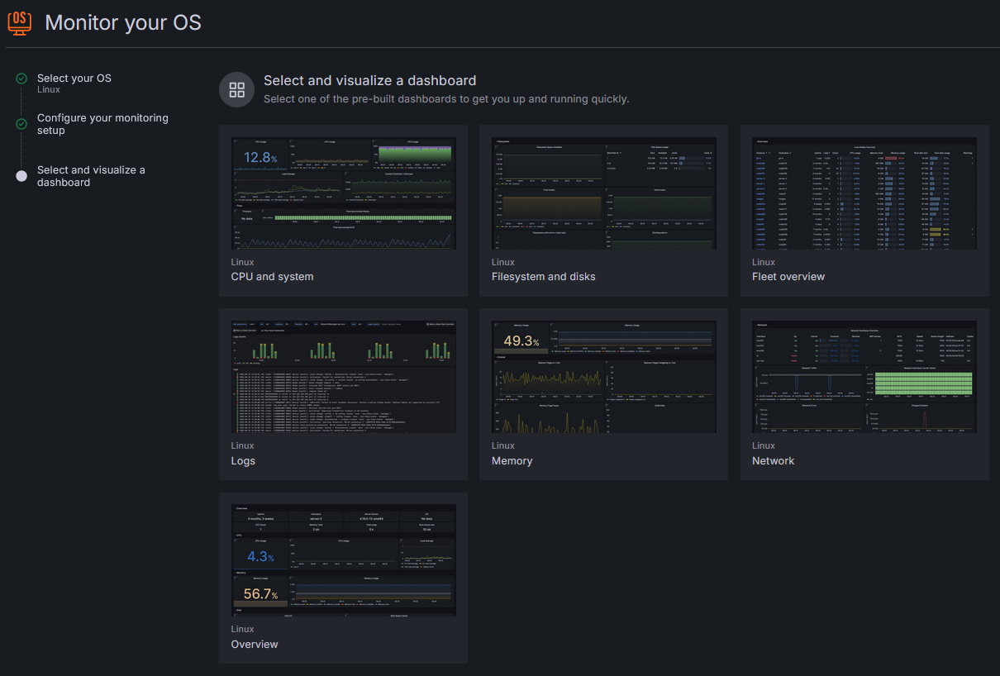
 Dashboard-Typ auswählen: "Overview" ausgewählt

9.6 Dashboard auslesen

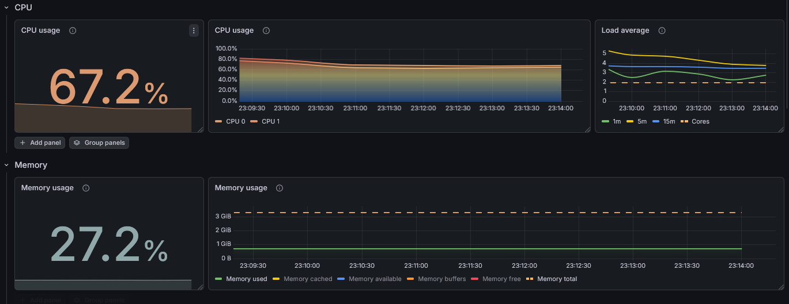
 Prozessor- und Arbeitsspeicherauslastung sind im Normalbereich"# Release v1.0.0" 
"# Release v1.0.0" 
